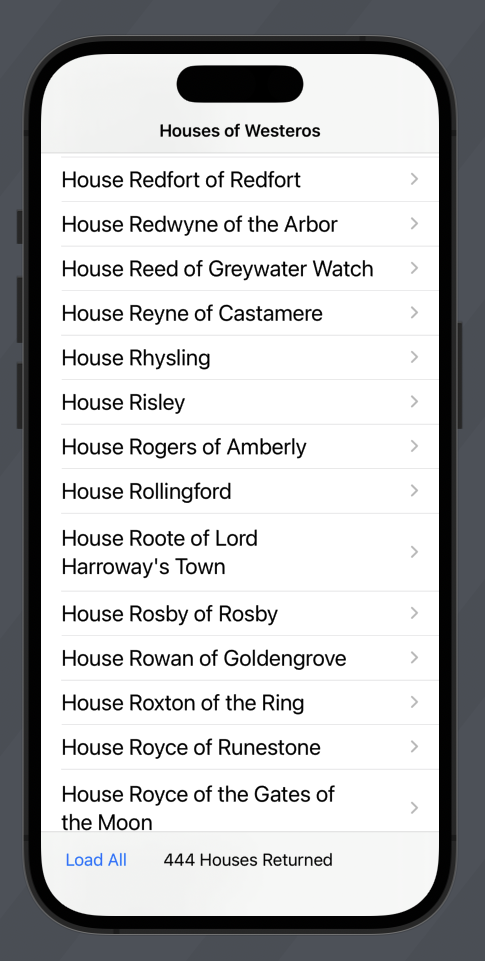
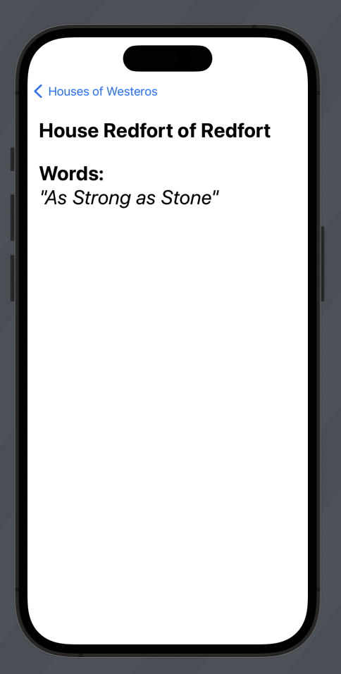

# ThronesAppChallenge
Challenge from Prof John Gallaugher, using dev API and JSON Parsing.

## Screenshots

  
  

## Challenge: Setup

- Create a new Xcode project named "Thrones"
- Rename the ContentView to NavigationStack
- Create a String array named houses that will (temporarily) hold Westeros houses. You can use any names you'd like. For example:
"Targaryen", "Lannister", "Stark", "Martell", "Greyjoy"
- Add a List to the navigation stack & show the names in the List. Font size title2. The List Style should be plain
- Add a Title to the Navigation Stack that states "Houses of Westeros".

## Challenge: Struct Setup

- We'll be accessing JSON using "An API of Ice and Fire" from this URL. It will return a page of 50 Game of Thrones Houses:
https://www.anapioficeandfire.com/api/houses?page=1&pageSize=50
- Create a struct named House to act as a Model for our Thrones app. It should be able to be used to decode our JSON & also be identifiable. In addition to a property to conform to identifiable it should contain:
name: a String, which will hold the name of the house
url: a String containing the url with house details
words: a String. The house motto or "words"

## Challenge: Houses ViewModel

- Create a class to use as a ViewModel for the Thrones app. Call this HousesViewModel.
- Decode an array of House structs. It should end up in a @Published property in the HouseViewModel class called houses, which is an array of House structs.
- Add a urlString property to the class using the URL:
https://www.anapioficeandfire.com/api/houses?page=1&pageSize=50
- Create a getData function of the class.
- Instantiate HousesViewModel as an object named housesVM.
- Call getData in the List View.
For now, simply print the results of the houses Struct to the console.

## Challenge: Add a ProgressView when loading

- Update the ViewModel to have an isLoading value that is true when data is loading, false otherwise.
- Use this to show or hide a ProgressView that's at the top of a ZStack with a ListView inside of it

Got this more quickly than your peers?
- Then try the challenge on the slide after this one this to add a .status ToolbarItem showing the # of houses downloaded

## Challenge: Add a Status Toolbar Item

- Add a Toolbar to the view
- It should initially include a ToolBarItem with a center placement (.status), which shows up as a bottom tool bar.
- Have the status show the # of houses that have been downloaded so far, like this:
# Houses Returned

## Challenge: Page JSON while Scrolling

- Load new pages of JSON while scrolling, if needed, until all pages are loaded.
- How do we page JSON when we don't have a "next" key in our JSON?
- The URL is:
https://www.anapioficeandfire.com/api/houses?page=1&pageSize=50
- Note that the "page" indicates which page of JSON is loaded.
Note that the pageSize is 50, and this is the # of houses per page
- Create a variable named pageNumber and initialize it to 1
- At the top of getData, add a line to an update to urlString inside getData so it uses the pageNumber. Use this 'updated' urlString to turn into a URL.
- When data is returned, examine the number of houses returned. If it's == 50, increment pageNumber by one, so that the next time getData is called, we cause use this to get the next page of JSON data.
If houses returned < 50, then set pageNumber to 0
- Instead of checking a string prefix for http (done in CatchEmAll), check to make sure the pageNumber != 0. If pageNumber is == 0, then do not call a new page of JSON.
- REMEMBER: When paging JSON you need to add the newly returned page of houses to the existing houses. I've seen LOTS of students forget this in texts / projects.

## Challenge: Load All

- Add a "Load All" button to the lower-left of the toolbar
When pressed, this should load all of the pages of JSON

## Challenge: Create a Detail View

- Add a DetailView to the ThronesApp
- It should look like the demo at the right. Note:
- The House Name and the Words: title are separated by padding
- If a house has words, they are enclosed in double-quotes
If a house has no words, then "n/a" is displayed
The Words are italicized
- The elements on the DetailView show up aligned to the upper-left of the screen.
- The elements on DetailView are in Title font

#### By John Gallaugher
https://bit.ly/prof-g-swiftui
